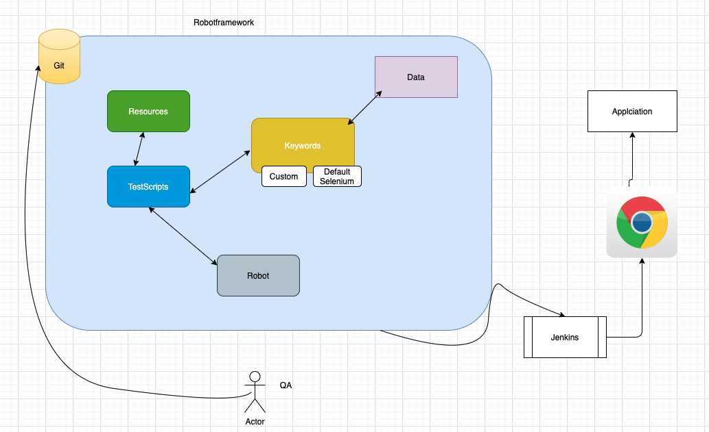
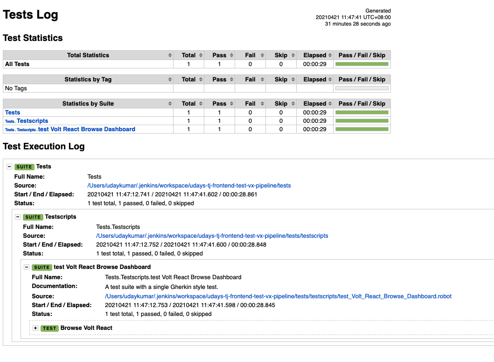

# Robotframework - A Solution for Web UI automation
## - RobotFramework + Python + Selenium + BDD -
## Features

- Download the repository and start writing feature files and step definitions
- This is just a template and customizable according to your project requirement
- Configured chrome and firefox browser, and it is extendable to other selenium supported browsers

## Tech

Tools used to dervice solution:

- [Robotframework] - build and project configuration
- [Selenium Bindings] - An open source UI automation tools

## Design


## Installation

This requires [python] 3.0+

Install the dependencies and devDependencies and start the server.

```sh
Download the repository using
        git clone https://github.com/uday160386/Python_BDD_RobotFramework_Selneium_boiler_plate.git
    and do
        python3 -m venv venv
        source venv/bin/activate
        pip install -r requirements.txt
```

## Configure Framework/tests
```sh
    Step definitions/tests: 
        Can be saved at location: tests/testscripts
    Custom keywords: 
        can be saved at tests/keywords
    Configurations/Resources:
        can be saved at tests/resources
    testdata: 
        can be saved at tests/data
```
Note:The above paths are for reference and can be saved at your preferred path
## How to execute Tests?
```sh
    robot --log reports/custome_log.html --output reports/output.xml --report reports/report.html 
    --variable BROWSER:Chrome tests 
        Note: This approach will be changed later
```

## How to view Report?
```sh
    There will be three types of reports:
        XML:    A XML report will be saved at reports/output.xml
        HTML:   A HTML report will be saved at reports/report.html
        LOG:    A LOG report will be saved at reports/custom_log.html
```

## Sample Report


## work is still in progress .....

[//]: # (These are reference links used in the body of this note and get stripped out when the markdown processor does its job. There is no need to format nicely because it shouldn't be seen. Thanks SO - http://stackoverflow.com/questions/4823468/store-comments-in-markdown-syntax)

[RobotFramework]: <https://robotframework.org/>
[Selenium Bindings]: <https://robotframework.org/SeleniumLibrary/SeleniumLibrary.html>
